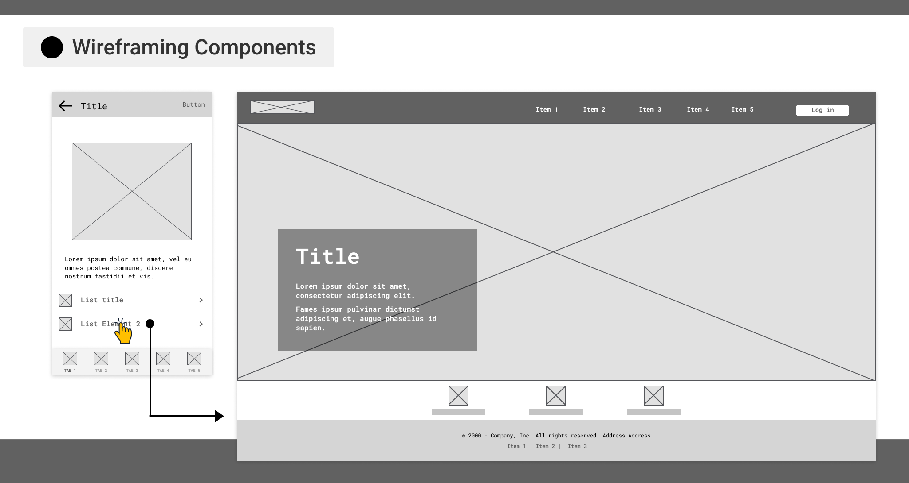

# 🚦 Smart Traffic Management System

## Deskripsi Singkat
Smart Traffic Management System adalah sistem berbasis AI yang mengoptimalkan durasi lampu lalu lintas secara real-time berdasarkan kepadatan kendaraan. Sistem ini bertujuan untuk mengurangi kemacetan, menghemat bahan bakar, dan meningkatkan efisiensi transportasi di perkotaan.

## Kelompok `Tetua Pancasila`
Ketua Kelompok:  Alex Cinatra Hutasoit - 22/505820/TK/55377

Anggota 1: Muhammad Rafli Ramadani - 22/497787/TK/54571

Anggota 2: Muhamad Farrel Adrian - 22/505897/TK/55394

## ✨ Fitur Utama
- 📡 Real-Time Traffic Monitoring – Menganalisis lalu lintas dengan kamera dan sensor IoT.

- 🤖 AI-Based Traffic Light Optimization – Menyesuaikan durasi lampu lalu lintas secara adaptif.

- 📊 Historical Traffic Data – Menyimpan data lalu lintas untuk analisis dan perencanaan kota.

- 🚑 Emergency Vehicle Priority System – Mendeteksi kendaraan darurat dan memberikan prioritas.

- 📌 Dashboard Manajemen – UI interaktif untuk memantau dan mengontrol lalu lintas.

## 🖼️ Lofi Design

## 🚀 Instalation Guides

`clone repo`

    git clone https://github.com/alexchtst-01/Smart-Traffic-Management-System.git

`get in the directory`
    
    cd Smart-Traffic-Management-System

`submodule init`
    
    git submodule update --init --recursive

`pull all repo`

    ./pull-repo.sh

`run all service locally`

    ./sunservice.sh